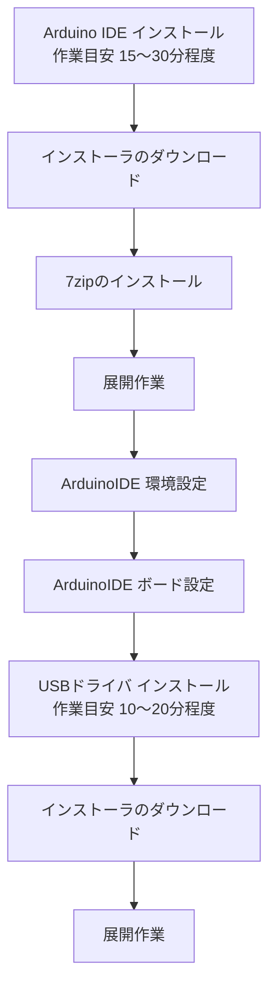

# 事前準備資料

## 変更履歴

|| 変更日時     | 変更内容 | 担当者   |
|--------------|----------|----------|
| 2024/06/01   | 初版     | PTK 中平 |

## 1. 概要

本マニュアルでは講座で使用するアプリケーション＝Arduino IDE と、USBシリアル通信を行うためのUSB ドライバのインストールを行う手順を示します。

- Arduino IDE
- Arduino-ESP32 サポート
- USBドライバ

